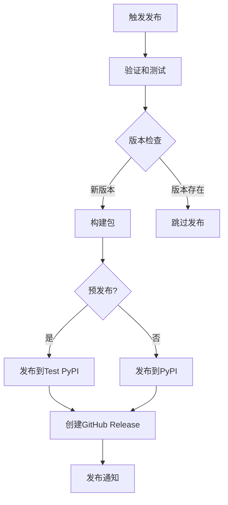

# DataMax CI/CD 自动发布解决方案

## 🎯 解决方案概述

本解决方案为DataMax项目提供了完整的自动化发布流程，包括：

- ✅ **自动版本管理**：支持语义化版本控制
- ✅ **PyPI自动发布**：支持正式版本和预发布版本
- ✅ **GitHub Release创建**：自动生成更新日志和标签
- ✅ **代码质量保证**：集成pre-commit钩子和安全检查
- ✅ **完整的测试流程**：包构建、验证和安装测试

## 📁 文件结构

```
datamax/
├── .github/
│   ├── workflows/
│   │   └── publish.yml          # 主要的GitHub Action工作流
│   ├── ISSUE_TEMPLATE/
│   │   └── bug_report.md        # Bug报告模板
│   └── pull_request_template.md # PR模板
├── scripts/
│   ├── bump_version.py          # 版本管理脚本
│   └── setup_ci.py              # CI/CD环境设置脚本
├── .pre-commit-config.yaml      # Pre-commit配置
├── DEPLOYMENT_GUIDE.md          # 详细部署指南
├── README_CI_CD.md              # 本文档
└── setup.py                     # 包配置文件
```

## 🚀 快速开始

### 1. 一键设置环境

```bash
# 运行自动设置脚本
python scripts/setup_ci.py

# 或手动安装依赖
pip install build twine pre-commit black isort flake8 bandit pytest pytest-cov
pre-commit install
```

### 2. 配置GitHub Secrets

在GitHub仓库设置中添加：

| Secret名称 | 描述 | 获取方式 |
|-----------|------|----------|
| `PYPI_API_TOKEN` | PyPI API令牌 | [PyPI Account Settings](https://pypi.org/manage/account/) |
| `TEST_PYPI_API_TOKEN` | 测试PyPI令牌（可选） | [Test PyPI](https://test.pypi.org/) |

### 3. 开始发布

#### 方法一：手动触发（推荐）
1. 进入GitHub Actions页面
2. 选择"发布到PyPI和创建标签"工作流
3. 点击"Run workflow"
4. 选择版本类型或输入自定义版本号

#### 方法二：Git标签触发
```bash
git tag v1.2.3
git push origin v1.2.3
```

#### 方法三：本地版本管理
```bash
# 增加补丁版本
python scripts/bump_version.py patch

# 增加次版本
python scripts/bump_version.py minor

# 设置特定版本
python scripts/bump_version.py 1.2.3
```

## 🔧 功能特性

### 智能版本管理

- **语义化版本控制**：遵循 [SemVer](https://semver.org/) 规范
- **自动版本递增**：支持major、minor、patch版本递增
- **预发布支持**：自动发布到Test PyPI
- **版本冲突检测**：自动检查PyPI版本重复

### 完整的CI/CD流程



### 代码质量保证

- **Pre-commit钩子**：提交前自动检查代码质量
- **代码格式化**：Black + isort自动格式化
- **静态分析**：Flake8代码检查
- **安全扫描**：Bandit安全漏洞检测
- **依赖同步**：自动检查requirements.txt和setup.py一致性

### 安全和权限控制

- **环境保护**：使用GitHub Environment保护生产发布
- **最小权限原则**：PyPI Token权限最小化
- **审核机制**：可选的人工审核流程
- **失败处理**：完善的错误处理和回滚机制

## 📊 发布流程详解

### 阶段1：验证和测试
- 代码检出和环境设置
- 安装构建依赖
- 自动版本管理
- 代码质量检查
- 包构建和验证
- PyPI版本冲突检查

### 阶段2：PyPI发布
- 预发布版本 → Test PyPI
- 正式版本 → PyPI
- 详细的上传日志

### 阶段3：GitHub Release
- 自动提交版本更新
- 创建Git标签
- 生成更新日志
- 创建GitHub Release
- 上传构建产物

### 阶段4：通知和清理
- 发布状态通知
- 提供访问链接
- 清理临时文件

## 🛠️ 自定义配置

### 修改Python版本
```yaml
# .github/workflows/publish.yml
env:
  PYTHON_VERSION: '3.11'  # 修改为所需版本
```

### 添加额外检查
```yaml
# 在验证阶段添加更多步骤
- name: 运行单元测试
  run: pytest tests/ -v

- name: 检查文档
  run: sphinx-build docs/ docs/_build/
```

### 集成通知服务
```yaml
# 添加Slack通知
- name: Slack通知
  uses: 8398a7/action-slack@v3
  with:
    status: ${{ job.status }}
    webhook_url: ${{ secrets.SLACK_WEBHOOK }}
```

## 📈 最佳实践

### 版本发布策略
1. **开发分支**：在feature分支开发新功能
2. **测试验证**：合并到main前进行充分测试
3. **预发布**：使用prerelease版本进行最终验证
4. **正式发布**：确认无误后发布正式版本

### 错误处理
1. **构建失败**：检查依赖和代码质量
2. **上传失败**：验证PyPI Token和网络连接
3. **版本冲突**：使用新的版本号重新发布

### 安全考虑
1. **定期轮换Token**：建议每6个月更新PyPI Token
2. **权限控制**：使用项目级别Token而非账户级别
3. **审核流程**：为重要发布启用人工审核

## 🆘 故障排除

### 常见问题

#### PyPI发布失败
```bash
# 检查Token权限
curl -H "Authorization: token pypi-xxx" https://pypi.org/legacy/

# 检查包名冲突
pip index versions datamax
```

#### 版本号问题
```bash
# 验证版本格式
python -c "from packaging import version; version.parse('1.2.3')"

# 检查setup.py语法
python setup.py check
```

#### 依赖问题
```bash
# 检查依赖兼容性
pip-compile requirements.in

# 测试安装
pip install -e .
```

## 📚 相关资源

- [GitHub Actions文档](https://docs.github.com/en/actions)
- [PyPI上传指南](https://packaging.python.org/guides/distributing-packages-using-setuptools/)
- [语义化版本控制](https://semver.org/lang/zh-CN/)
- [Pre-commit框架](https://pre-commit.com/)

## 📞 技术支持

如果在使用过程中遇到问题：

1. 查看GitHub Actions运行日志
2. 参考 `DEPLOYMENT_GUIDE.md` 详细说明
3. 运行 `python scripts/setup_ci.py --help` 获取帮助
4. 在项目仓库创建Issue报告问题

---

**Happy Shipping! 🚀**
